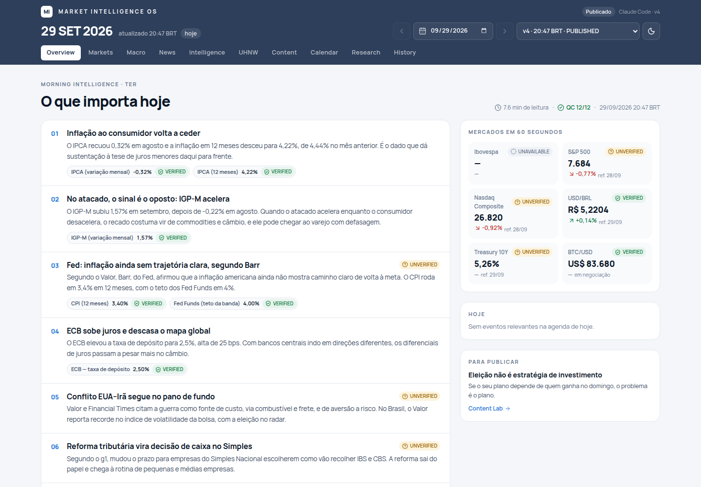

# Market Intelligence OS

Sistema pessoal de inteligência de mercado, macroeconomia, patrimônio e estratégia de conteúdo.
Projeto **independente**: não reutiliza código, banco ou infraestrutura do WealthOS, que vive no mesmo repositório em outra pasta.

```
FONTES → COLETA → VALIDAÇÃO → FATOS VERIFICADOS → INTERPRETAÇÃO → INTELIGÊNCIA → CONTEÚDO → ESTRATÉGIA SOCIAL
```

A regra que governa tudo: **dados vêm antes das interpretações.** O Agent 1 coleta e verifica. Os agentes 2 e 3 só enxergam `verified_facts`. Todo número publicado tem fonte, e o controle de qualidade remove qualquer número sem lastro antes de salvar.



## Componentes

| Componente | O que faz | Onde |
|---|---|---|
| **Agent 1**: Market Intelligence & Research | Coleta determinística (APIs, CSV, RSS), validação, clustering de notícias | `src/agents/market-intelligence` |
| **Verification Engine** | VERIFIED / UNVERIFIED / CONFLICT / REJECTED / UNAVAILABLE | `src/verification` |
| **Agent 2**: Financial Intelligence (CFP/CFA + copywriter) | Morning Brief, UHNW Lens, Content Lab, com uma única chamada de LLM | `src/agents/financial-intelligence` |
| **Agent 3**: Social Strategist | Event Engine, calendário editorial, oportunidades, análise de métricas | `src/agents/social-strategist` |
| **Orchestrator** | Pipeline diário na ordem certa, com fail-safe | `src/agents/orchestrator` |
| **Research Broker** | Um agente pede dados ao Agent 1 em vez de improvisar | `src/engines/research-broker.ts` |
| **Quality Control** | 12 checagens + correção automática antes de salvar | `src/engines/quality-control.ts` |
| **Storage** | Supabase/Postgres (produção), JSON local (dev), memória (testes) | `src/storage` |
| **Dashboard** | Next.js, navegação histórica e UX de verificação | `src/app` |
| **Observabilidade** | `agent_runs` para toda execução | `src/observability` |

## Rodar localmente

```bash
cd market-intelligence-os
npm install
cp .env.example .env.local          # MI_STORAGE=file funciona sem nenhuma chave

# Rodar o pipeline agora (coleta real, se a rede permitir)
npm run mi -- morning

# Reproduzir o primeiro teste real (offline, a partir do bundle coletado em 29/09/2026)
npm run mi -- morning --bundle docs/first-run/bundle-2026-09-29.json --mode claude_code --offline
npm run mi -- submit --date 2026-09-29 --file docs/first-run/analysis-2026-09-29.json
npm run mi -- audit --date 2026-09-29

npm run dev                          # http://localhost:3000
```

## Comandos

| Comando | Descrição |
|---|---|
| `npm run mi -- morning [--date] [--bundle f] [--mode m] [--offline]` | MORNING_INTELLIGENCE agora |
| `npm run mi -- collect --out bundle.json` | Só coleta, gerando um bundle portátil |
| `npm run mi -- packet [--date]` | Pacote de análise pendente (hand-off para o Claude Code) |
| `npm run mi -- submit --date D --file analysis.json` | Publica a análise (valida + QC + nova versão) |
| `npm run mi -- close-refresh` / `weekly` | MARKET_CLOSE_REFRESH / WEEKLY_SOCIAL_STRATEGY |
| `npm run mi -- research "pergunta"` | ON_DEMAND_RESEARCH |
| `npm run mi -- import-social arquivo.csv` | Importa métricas do Instagram |
| `npm run mi -- audit [--date]` | Auditoria automática do snapshot |
| `npm run mi -- runs [--date]` | Execuções (observabilidade) |
| `npm run mi -- sync --from data` | Copia o store local para o Supabase |
| `npm test` / `npm run test:e2e` / `npm run build` | Testes unitários / Playwright / build |

## Documentação

- [Arquitetura](docs/architecture.md)
- [Agentes](docs/agents.md)
- [Market Intelligence (Agent 1, fontes)](docs/market-intelligence.md)
- [Financial Intelligence (Agent 2, perfil editorial)](docs/financial-intelligence.md)
- [Social Strategy (Agent 3, calendário)](docs/social-strategy.md)
- [Verificação](docs/verification.md)
- [Modelo de dados](docs/data-model.md)
- [Dashboard](docs/dashboard.md)
- [Automação e jobs](docs/automation.md)
- [Deploy](docs/deployment.md)
- [Primeiro teste real (29/09/2026)](docs/first-run/README.md)
- [Source Coverage Audit (30/09/2026): cobertura por ativo, BRAPI/MCP, fontes gratuitas](docs/coverage-audit/README.md)
