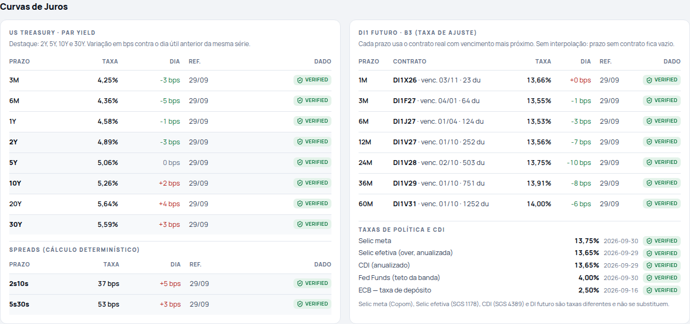
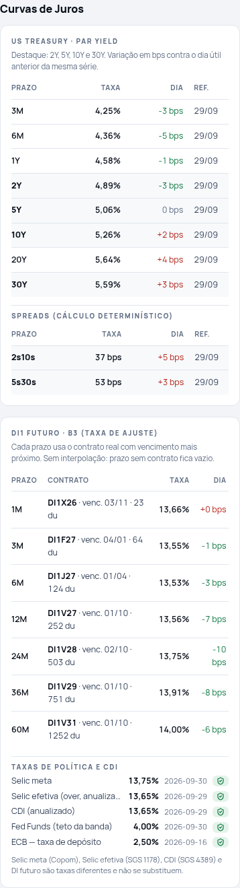
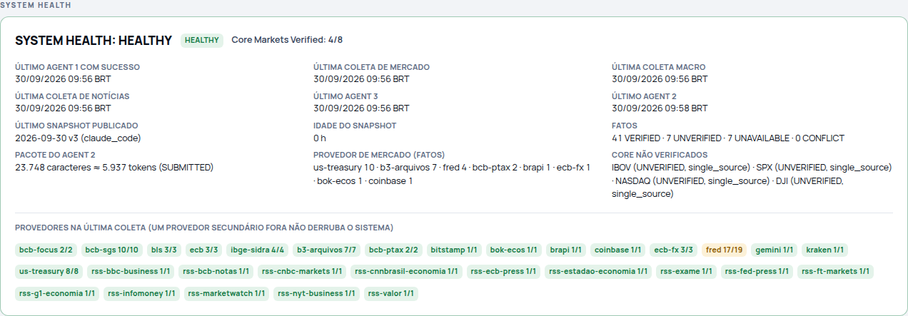
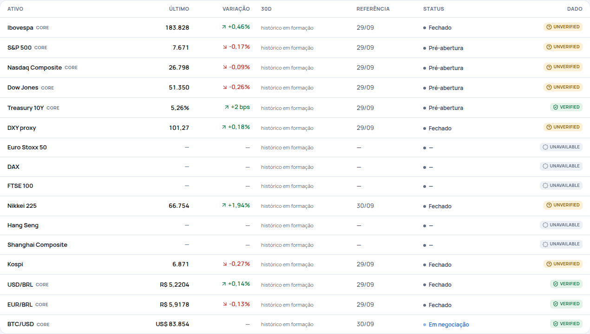

# MVP run final — rodada 3 (30/09/2026)

Não houve deploy de produção. Tudo abaixo roda no repositório, com store em arquivo.

## Execução
1. **Agent 1, coleta real:** Vercel Sandbox (iad1), 30/09 12:27 UTC (09:27 BRT), código do commit `27ca201`. Resultado: 64 observações, 333 notícias e 78 de 80 consultas a fontes OK (`bundle-2026-09-30.json`; o md5 do pacote transferido conferiu).
   - Falhas: FRED `CPIAUCNSL` HTTP 404 e FRED `CHNCPIALLMINMEI` vazio. O CPI dos EUA continua VERIFIED pela fonte oficial (BLS).
   - IBOV via MCP da BRAPI (`brapi-mcp-observations-2026-09-30.json`). O `regularMarketTime` era 09:44 BRT, antes da abertura da B3, então o valor é o fechamento de 29/09.
   - O primeiro run no sandbox revelou um bug real: o arquivo da B3 (5,4 MB) excedia o limite de 5 MB do cliente HTTP. Corrigido em `27ca201` e coletado de novo.
2. **Verificação:** 55 fatos: 41 VERIFIED, 7 UNVERIFIED, 7 UNAVAILABLE, 0 CONFLICT, 0 REJECTED (`facts-2026-09-30.json`).
3. **Agent 3:** agenda e oportunidades. O Payroll de 02/10 entrou como pedido event-driven.
4. **Agent 2, nível 1 (determinístico):** v1 `PUBLISHED`, `analysis_mode = deterministic`, QC aprovado em modo apenas fatos.
5. **Pacote:** 23.976 caracteres (≈ 5.994 tokens), 32 fatos, 14 clusters, 8 itens de agenda. Corte registrado: "fatos citáveis 39 → 32 (secundários removidos)" (`packet-2026-09-30.json`).
6. **Agent 2, nível 2 (hand-off do Claude Code):** `analysis-2026-09-30.json` → v2 `PUBLISHED`, `claude_code`, 970 palavras, 6,5 min. Reenviar a mesma análise devolveu a v2 (idempotente).
7. **Auditoria:** `audit-2026-09-30.json` → **PASS_WITH_WARNINGS**. Os avisos são Core 4/8 e as falhas do FRED.

## O QC de métrica em dado real
Na primeira versão da análise, o QC **bloqueou dois itens** por substituição de métrica:
- "o rendimento de 10 anos subiu para 5,26% … com o Fed Funds em 4%": o 5,26% é do Treasury, mas a frase só nomeava o Fed.
- "o DI de cinco anos ficou em 13,997%, acima da Selic efetiva": o alias do DI não reconhecia "DI de cinco anos". O alias foi ampliado (com teste), e a frase passou a ser atribuída corretamente ao DI futuro.

O texto foi corrigido e reenviado. Em todas as versões, o item "IPCA-15" tem como evidência principal o fato `BR_IPCA15_MOM` (0,70%, setembro, IBGE/SIDRA 7062, divulgado em 25/09), nunca o IPCA de agosto (-0,32%) nem o IGP-M.

## Verificações pedidas
| Item | Resultado |
|---|---|
| IPCA-15 | `BR_IPCA15_MOM` 0,70% (2026-09), divulgado em 25/09/2026, VERIFIED/`official_crosscheck` (SIDRA 7062 × SGS 7478). Cluster "IPCA-15 surpreende…" em 2º lugar (72), override "Divulgação oficial" |
| Core markets | **4/8 VERIFIED**: USD/BRL e EUR/BRL (PTAX × ECB, `independent_crosscheck`), BTC/USD (Coinbase × Kraken), Treasury 10Y (US Treasury, `official_single`). IBOV (só BRAPI), S&P 500, Nasdaq e Dow (só FRED) ficam UNVERIFIED/`single_source`, sem segunda fonte fabricada |
| Curva do Treasury | 8/8 vértices (3M 4,25% … 30Y 5,59%, 29/09). 2s10s 37 bps (+5), 5s30s 53 bps (+3), `derived` |
| Curva DI | 7/7 buckets com contratos reais: 1M DI1X26, 3M DI1F27, 6M DI1J27, 12M DI1V27, 24M DI1V28, 36M DI1V29, 60M DI1V31 (taxas de ajuste de 29/09, variação contra 28/09) |
| Selic / CDI | Selic meta 13,75%, Selic efetiva 13,65%, CDI 13,65%, cada uma como métrica separada |
| Ranking | Top 14 / watchlist 25 / cauda 277 clusters, com 20 hard overrides |
| Cobertura | 10/10 categorias cobertas (Brasil 4, Mundo 6) |
| Citações | 32 citações, todas a fatos VERIFIED e atuais; linhas de mercado conferem com `verified_facts` |
| QC | Aprovado nas duas versões, com reexecução idempotente e Metric Alignment OK |

## Imagens (dado real)
| | |
|---|---|
|  |  |
|  |  |

## Reproduzir
```bash
export MI_STORAGE=file MI_DATA_DIR=/tmp/mi-r3 MI_LLM_PROVIDER=claude_code
npm run mi -- morning --bundle docs/mvp-run-r3/bundle-2026-09-30.json --observations docs/mvp-run-r3/brapi-mcp-observations-2026-09-30.json --mode claude_code --offline
npm run mi -- packet --date 2026-09-30   # os fact_ids mudam a cada run: remapeie por métrica antes de reenviar
npm run mi -- submit --date 2026-09-30 --file docs/mvp-run-r3/analysis-2026-09-30.json
npm run mi -- audit --date 2026-09-30
```
