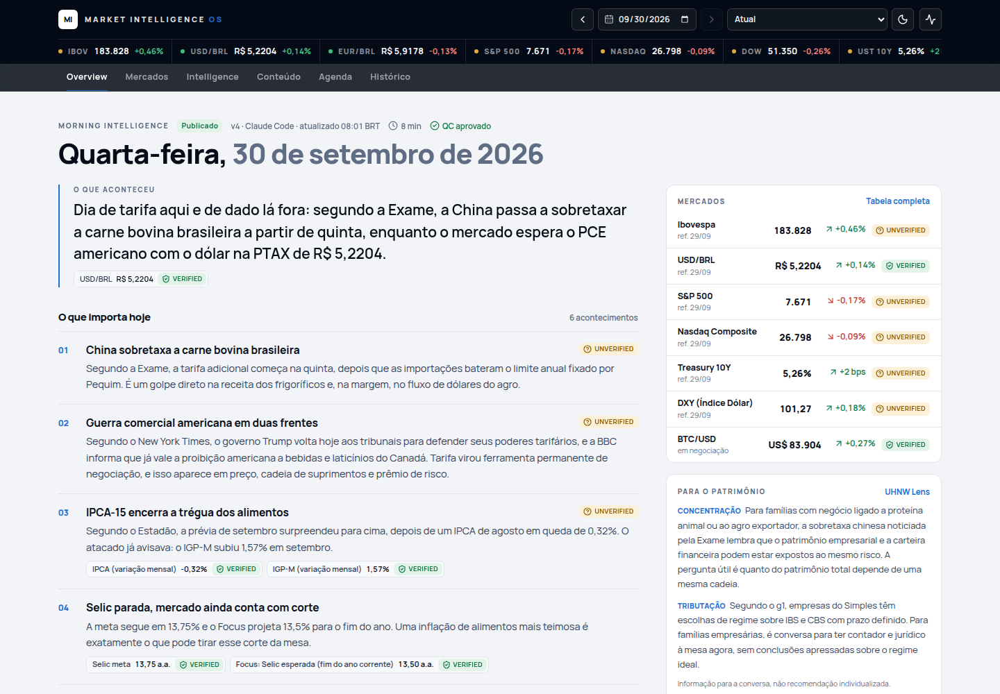
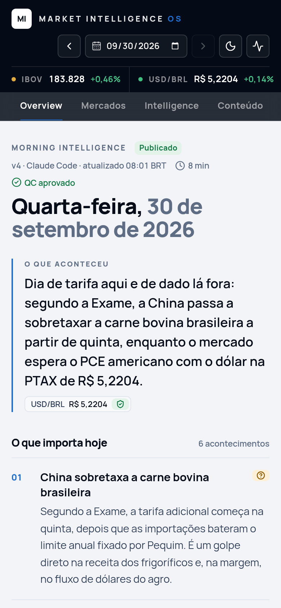
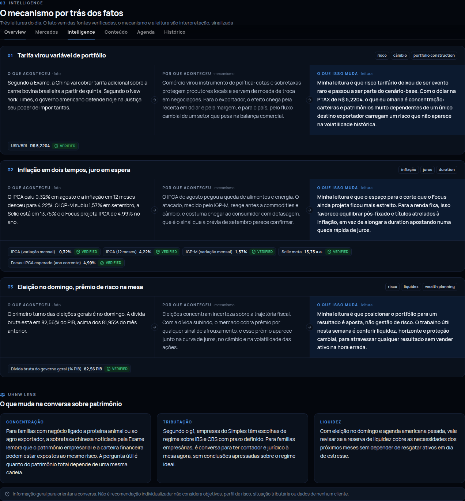
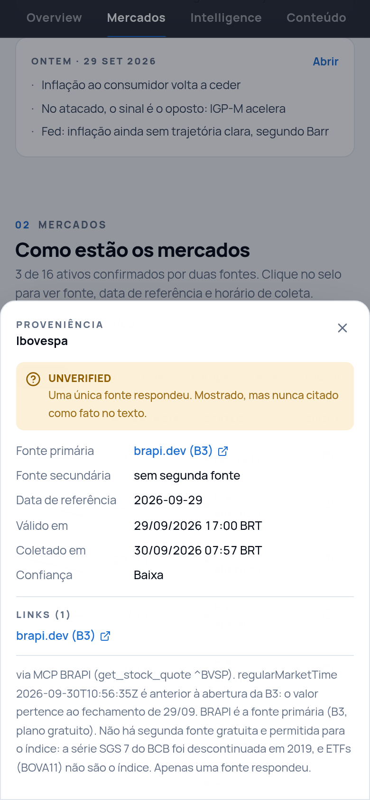
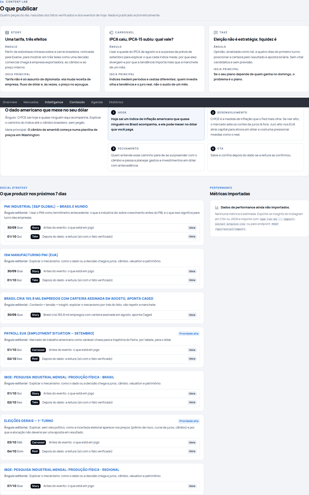
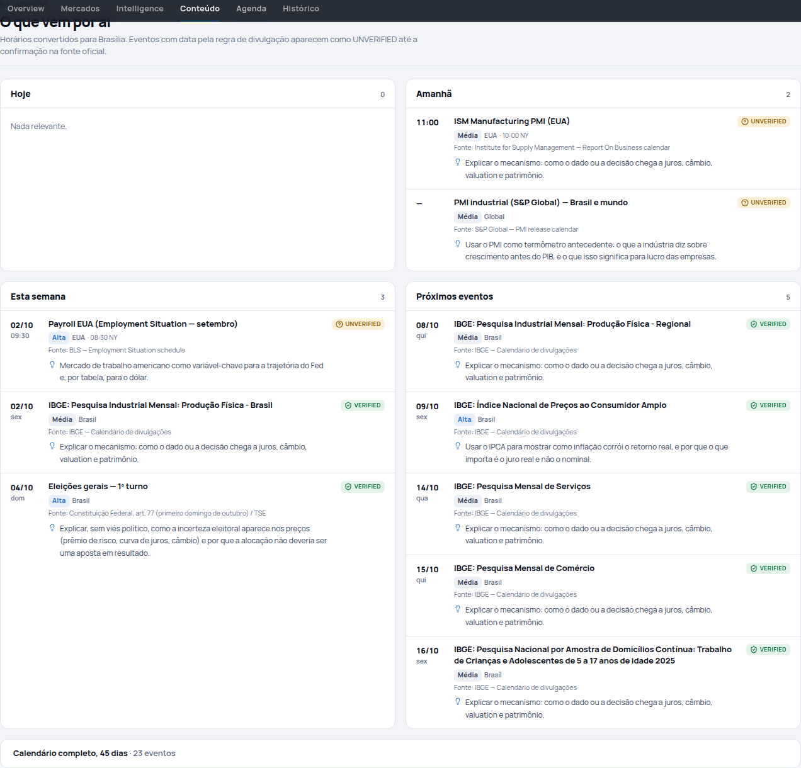
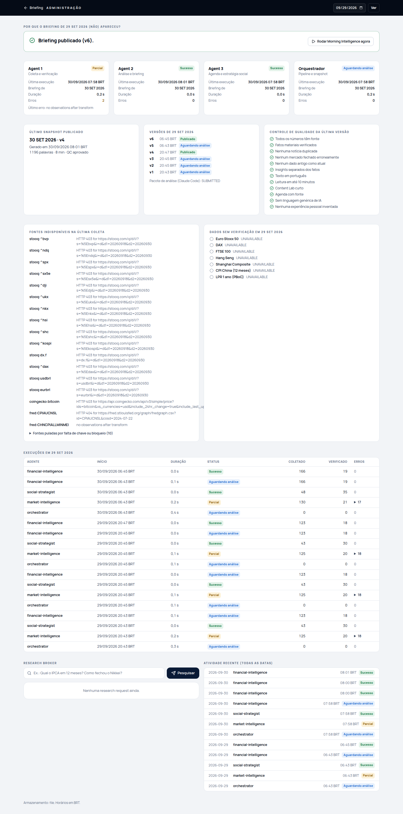

# Teste final do MVP: RUN MORNING INTELLIGENCE NOW (30/09/2026)

## Execução
1. **Agent 1 (coleta real):** Vercel Sandbox (iad1) às 07:57 BRT com o código do commit `bf667aa`. Resultado: 39 observações, 327 notícias (90 transportadas pelo score determinístico) e 12 eventos do IBGE (`bundle-2026-09-30.json`, md5 conferido). O Ibovespa veio do MCP da BRAPI (`brapi-mcp-observations-2026-09-30.json`). O horário do feed era 07:56 BRT, antes da abertura, e o valor foi corretamente atribuído ao fechamento de 29/09. Stooq e CoinGecko foram pulados, sem erro. O calendário do BLS respondeu 403 e não houve nova tentativa.
2. **Verificação:** 21 VERIFIED · 8 UNVERIFIED · 7 UNAVAILABLE · 0 REJECTED (Selic de hoje verificada).
3. **Agent 3:** agenda com Hoje/Amanhã/Esta semana/Próximos, oportunidades para os próximos 7 dias e o Payroll como pedido event-driven.
4. **Agent 2 (hand-off do Claude Code):** `analysis-2026-09-30.json`, com lede, 6 acontecimentos, 3 insights com lentes, 3 pontos UHNW com tema e Content Lab com roteiro de Reel.
5. **QC e histórico (append-only):**
   - v1 `AWAITING_ANALYSIS`.
   - v2 `PUBLISHED`: o QC removeu um ponto UHNW que citava notícia de fonte única sem atribuição.
   - v3: o ponto foi corrigido e voltou, com 1.207 palavras (aviso consultivo de meta).
   - **v4 `PUBLISHED`**: 1.196 palavras, 8 min, todas as checagens aprovadas.
6. **Auditoria:** `audit-2026-09-30.json` deu **PASS_WITH_WARNINGS**. O único aviso é de fontes externas (FRED CPIAUCNSL 404 e série de CPI da China vazia).
7. **Testes:** `npm test` 78/78 · `npm run typecheck` ok · `npm run build` ok · `npm run test:e2e` 14/14 (desktop e mobile).

## Verificação visual
| | |
|---|---|
|  |  |
|  |  |
|  |  |



Problemas visuais encontrados e corrigidos nesta verificação:
- Overflow horizontal no mobile, causado por `sr-only` da faixa de mercados e por cards da agenda sem `min-w-0`.
- Controles do topo transbordando no celular.
- Grade do Content Lab com um buraco.
- Pipeline social repetitivo, agora agrupado por evento.
- Agenda espremida em 4 colunas, agora 2×2.
- Selo "fallback" que aparecia em quase todo dado.

## Reproduzir
```bash
npm run mi -- morning --bundle docs/mvp-run/bundle-2026-09-30.json --observations docs/mvp-run/brapi-mcp-observations-2026-09-30.json --mode claude_code --offline
npm run mi -- packet --date 2026-09-30   # os fact_ids mudam a cada run; ajuste o analysis.json antes de reenviar
npm run mi -- submit --date 2026-09-30 --file docs/mvp-run/analysis-2026-09-30.json
npm run mi -- audit --date 2026-09-30
```
